# Top-N Interface Traffic Visibility-SONiC Feature

## Table of Contents

1. [Project Overview](#project-overview)
2. [Problem Statement](#problem-statement)
3. [Repository Structure](#repository-structure)
4. [The Prototype-What It Is and Why It Exists](#the-prototype)
5. [Min-Heap Algorithm-Deep Explanation](#min-heap-algorithm)
6. [Prototype Walkthrough-File by File](#prototype-walkthrough)
7. [Prototype Limitations](#prototype-limitations)
8. [The Actual Solution-Architecture](#the-actual-solution)
9. [Full Data Flow](#full-data-flow)
10. [Key Difference: Single Snapshot vs Delta Sampling](#key-difference)
11. [How to Run the Prototype](#how-to-run-the-prototype)
12. [What Comes Next](#what-comes-next)

---

## Project Overview

This project implements a **Top-N Interface Traffic Visibility** feature for **SONiC** (Software for Open Networking in the Cloud), Microsoft's open-source network operating system used in large-scale data center switches.

The goal is simple: **given hundreds of network interfaces on a switch, instantly identify which ones are carrying the most traffic.**

This is critical for:
- **Network operators** diagnosing congestion or unexpected traffic spikes
- **Capacity planners** identifying links approaching saturation
- **Automation pipelines** that need programmatic access to traffic rankings

---

## Problem Statement

SONiC already collects per-interface traffic counters and exposes them via `show interfaces counters`. However, on a switch with 128+ interfaces, an operator must manually scan every row to find the busiest ones. This is:

- **Slow**-reading 128 rows takes time and attention
- **Error-prone**-humans miss rows under pressure
- **Not automation-friendly**-no machine-readable sorted output exists

**What we need:** A single command that answers *"which interfaces are carrying the most traffic right now?"* in under 5 seconds.

---

## Repository Structure

### Prototype Layout

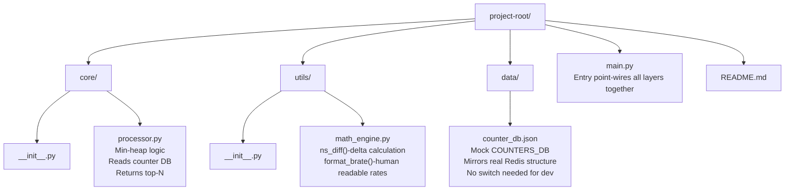

### How Prototype Maps to Real SONiC Repository

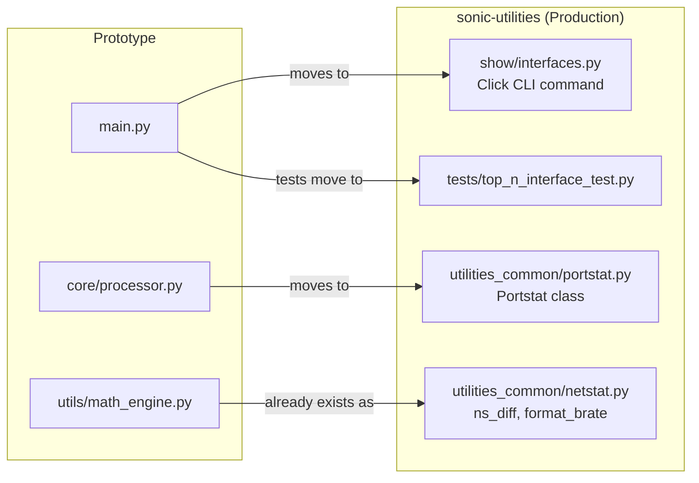

---

## The Prototype

### What It Is

The prototype is a **standalone Python script** that simulates the core logic of the final feature **without requiring a real SONiC switch or Redis database**. It reads from a local JSON file that mirrors the exact structure of SONiC's `COUNTERS_DB`.

### Why Build a Prototype First

Before integrating into a complex codebase like `sonic-utilities`, a prototype lets you:

1. **Validate the algorithm**-confirm the min-heap produces correct rankings
2. **Understand the data shape**-explore what COUNTERS_DB actually contains
3. **Test formatting**-see what output looks like before wiring up CLI
4. **Iterate fast**-no SONiC environment needed, runs anywhere with Python

### Prototype Internal Architecture

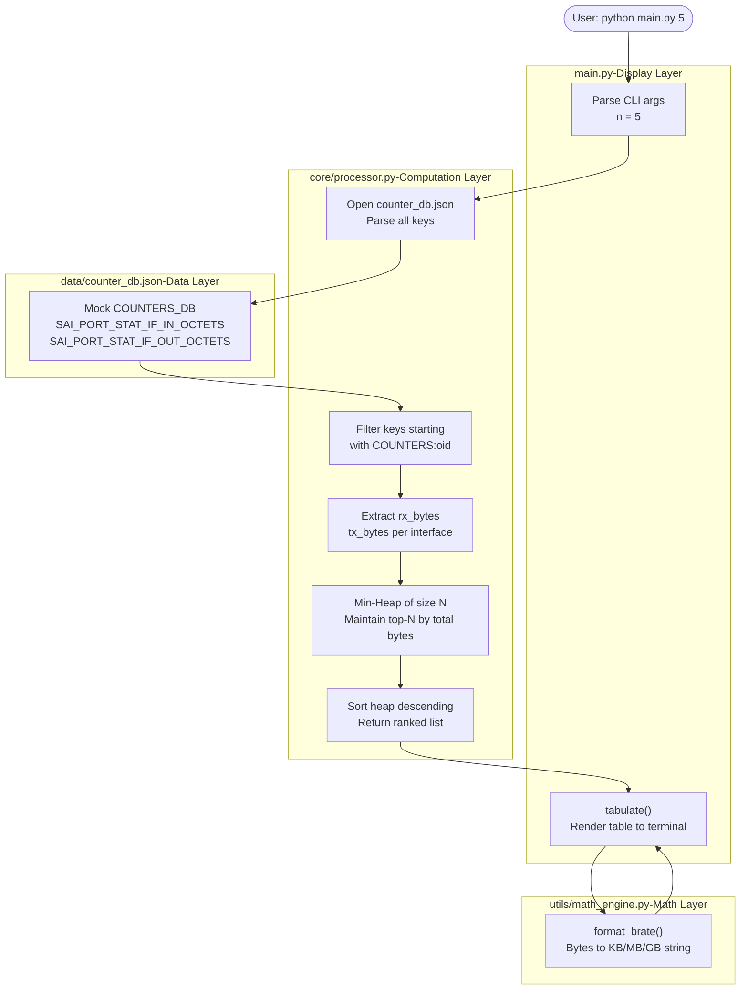

---

## Min-Heap Algorithm

This is the most important algorithmic decision in the entire project. Understanding it deeply will matter when you present or defend the implementation.

### The Naive Approach (Do Not Use)

The obvious solution to "find top N from a list" is:

```python
# Sort all interfaces by traffic
all_interfaces = sorted(all_data, key=lambda x: x['total'], reverse=True)
# Take first N
top_n = all_interfaces[:n]
```

**Why this is wrong for production:**

On a 128-port switch, this sorts all 128 entries every time. SONiC runs on switches with up to **512 interfaces**. You asked for top 5-you do not need to precisely sort the bottom 507. Time complexity: **O(k log k)** where k = total interfaces.

### The Min-Heap Approach (What We Use)

A **min-heap of size N** maintains only the N largest elements seen so far. The ROOT of the heap is always the **smallest** of the current top-N-the first one to get evicted when a better candidate arrives.

### Step-by-Step Heap Walkthrough (top 3 from 6 interfaces)

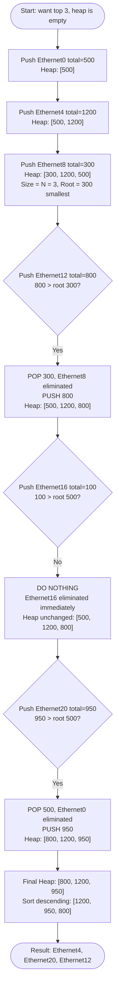

### Heap State at Key Steps

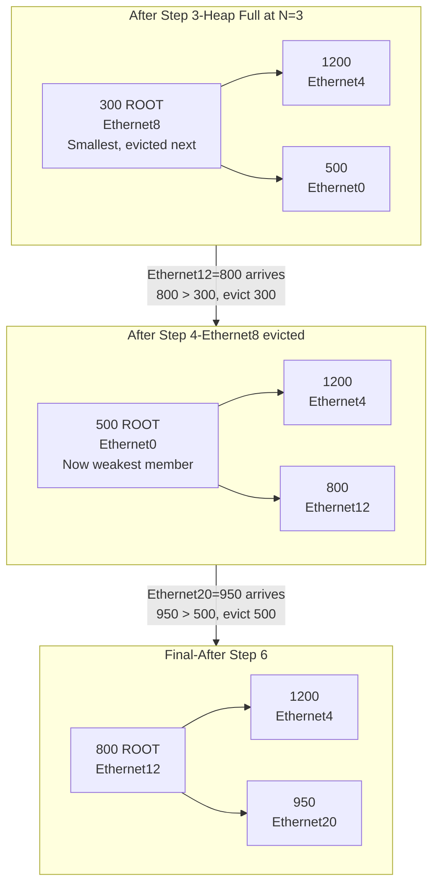

### Complexity Comparison

| Approach | Time Complexity | Space Complexity | k=512, n=5 |
|---|---|---|---|
| Sort all | O(k log k) | O(k) | 4,608 operations |
| Min-heap | O(k log n) | O(n) | 1,177 operations |

The heap does **75% less work** and holds only N items in memory regardless of total interface count.

### The Code

```python
# core/processor.py

import heapq

min_heap = []

for key, content in data.items():
    if key.startswith("COUNTERS:oid"):

        rx_bytes = int(vals.get('SAI_PORT_STAT_IF_IN_OCTETS', 0))
        tx_bytes = int(vals.get('SAI_PORT_STAT_IF_OUT_OCTETS', 0))
        total_bytes = rx_bytes + tx_bytes

        # Python's heapq is a MIN-heap
        # heapq compares on the first element of the tuple
        entry = (total_bytes, info_dict)
        heapq.heappush(min_heap, entry)

        # If heap exceeds N, pop the SMALLEST (the root)
        # This keeps only the N largest seen so far
        if len(min_heap) > n:
            heapq.heappop(min_heap)

# Sort the remaining N items descending for display
return sorted(min_heap, key=lambda x: x[0], reverse=True)
```

---

## Prototype Walkthrough-File by File

### `data/counter_db.json`-The Mock Database

This file mirrors the exact structure of SONiC's Redis `COUNTERS_DB`. In production, data lives in Redis. In the prototype, it lives in this JSON file.

```json
{
  "COUNTERS_PORT_NAME_MAP": {
    "value": {
      "Ethernet0": "oid:0x1000000000001",
      "Ethernet4": "oid:0x1000000000002"
    }
  },
  "COUNTERS:oid:0x1000000000001": {
    "value": {
      "SAI_PORT_STAT_IF_IN_OCTETS":  "1048576000",
      "SAI_PORT_STAT_IF_OUT_OCTETS": "524288000"
    }
  }
}
```

### Database Key Structure

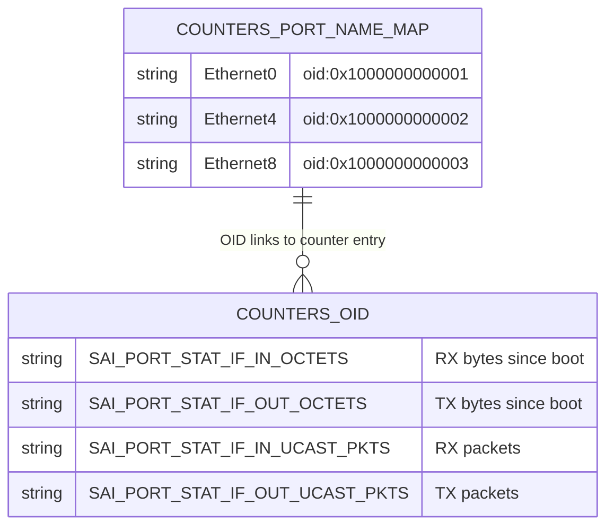

### `utils/math_engine.py`-Pure Math Layer

```python
def ns_diff(new_val, old_val):
    diff = int(new_val) - int(old_val)
    return max(0, diff)   # guard against counter resets
```

The `max(0, diff)` guard handles counter resets-if a counter rolls back to zero after a reboot or clear, we return 0 instead of a massive negative number.

### Counter Reset Guard Logic

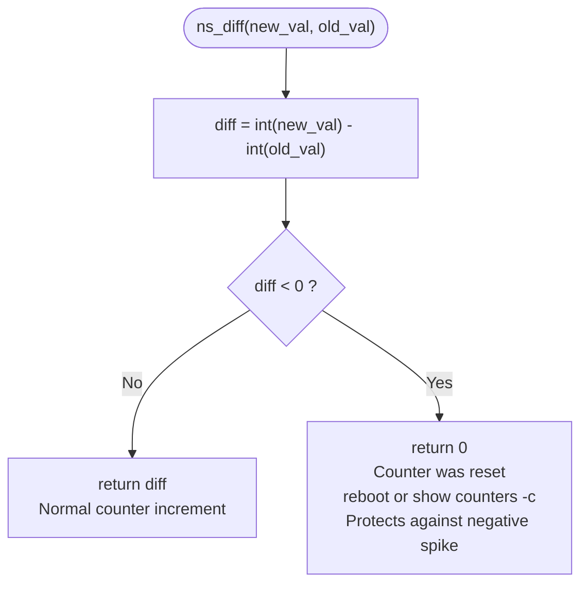

---

## Prototype Limitations

| Gap | Prototype | Production Solution |
|---|---|---|
| **Sampling** | Single snapshot, absolute bytes | Two snapshots, delta = actual rate |
| **Interface names** | Shows raw OIDs | Maps OIDs to Ethernet names |
| **Port state** | Not shown | U / D / X column |
| **Database** | JSON file | Live Redis via `swsscommon` |
| **CLI** | `python main.py` | `show interfaces counters top-n` |
| **JSON flag** | Not supported | `--json` flag |
| **Interval config** | Not supported | `--interval` flag |
| **Utilization %** | Not shown | RX_UTIL and TX_UTIL columns |

---

## The Actual Solution

### Full System Architecture

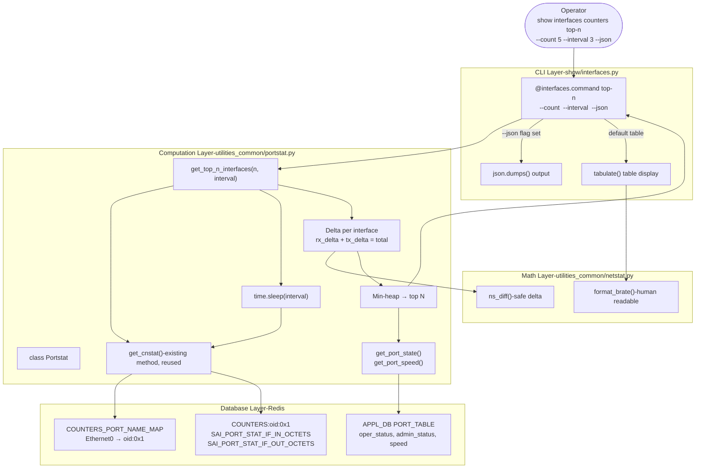

---

## Full Data Flow

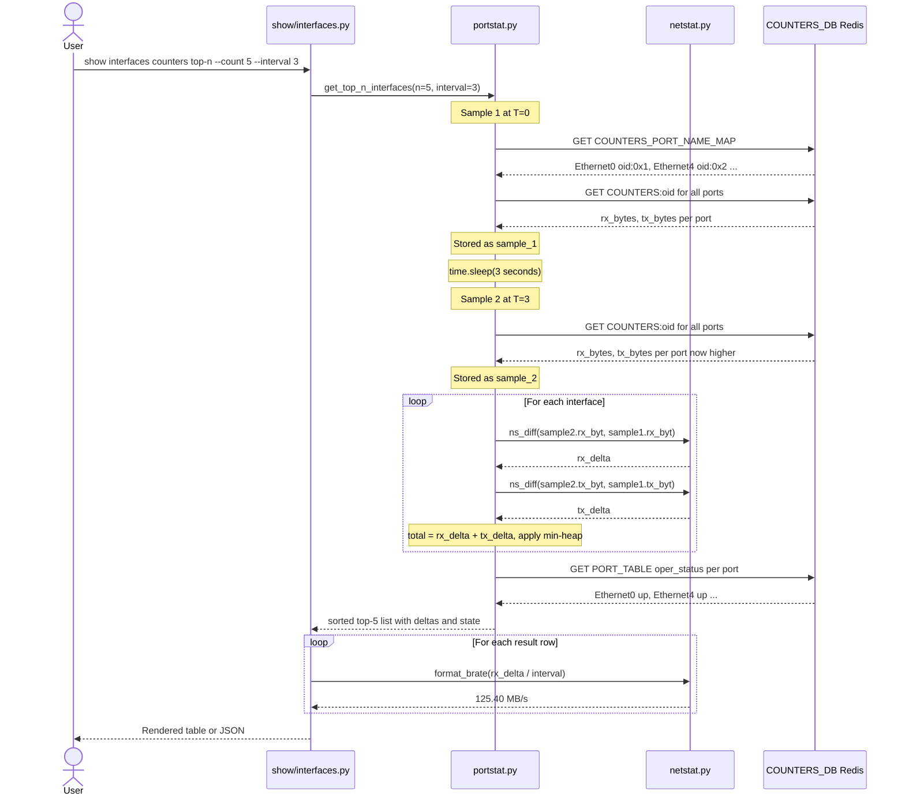

---

## Key Difference: Single Snapshot vs Delta Sampling

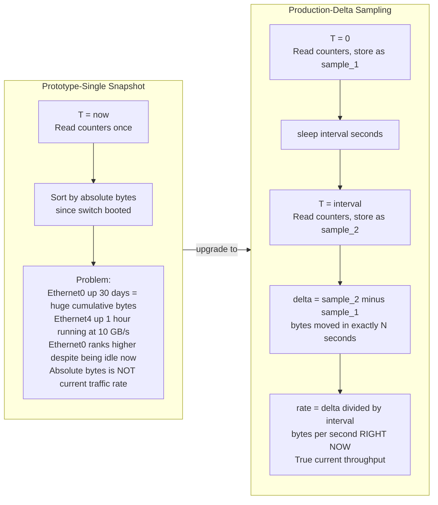

---

## How to Run the Prototype

### Prerequisites

```bash
pip install tabulate
```

### Running

```bash
# Default: top 5
python main.py

# Top 10
python main.py 10

# All interfaces
python main.py all
```

### Expected Output

```
--- Top 5 Interfaces ---
Rank  Interface               RX_Total     TX_Total     Total_Bytes
----  ----------------------  -----------  -----------  -----------
1     oid:0x1000000000005     125.40 MB/s  80.20 MB/s   205.60 MB/s
2     oid:0x1000000000002     90.10 MB/s   60.50 MB/s   150.60 MB/s
3     oid:0x1000000000008     40.00 MB/s   20.00 MB/s   60.00 MB/s
4     oid:0x1000000000001     1.20 KB/s    500.00 B/s   1.70 KB/s
5     oid:0x1000000000003     100.00 B/s   50.00 B/s    150.00 B/s
```

> **Note:** Interface names show OIDs in the prototype. The production solution resolves these to `Ethernet0`, `Ethernet4` etc. via `COUNTERS_PORT_NAME_MAP`.

---

## What Comes Next

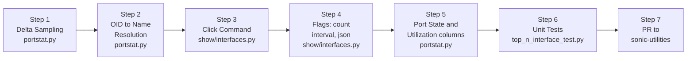

| Step | Task | Files Changed |
|---|---|---|
| 1 | Delta sampling-two `get_cnstat()` calls with `time.sleep()` | `utilities_common/portstat.py` |
| 2 | OID → interface name via `COUNTERS_PORT_NAME_MAP` | `utilities_common/portstat.py` |
| 3 | Click command `show interfaces counters top-n` | `show/interfaces.py` |
| 4 | `--count`, `--interval`, `--json` flags | `show/interfaces.py` |
| 5 | Port state and utilization columns | `utilities_common/portstat.py` |
| 6 | Unit tests using existing mock DB JSON | `tests/top_n_interface_test.py` |
| 7 | PR to sonic-utilities following contribution guidelines | All above files |

---

*This document covers both the prototype (proof of concept) and the full production design. The prototype validates the core algorithm. The production implementation integrates it into SONiC's CLI with real database access, delta sampling, and complete output formatting.*
